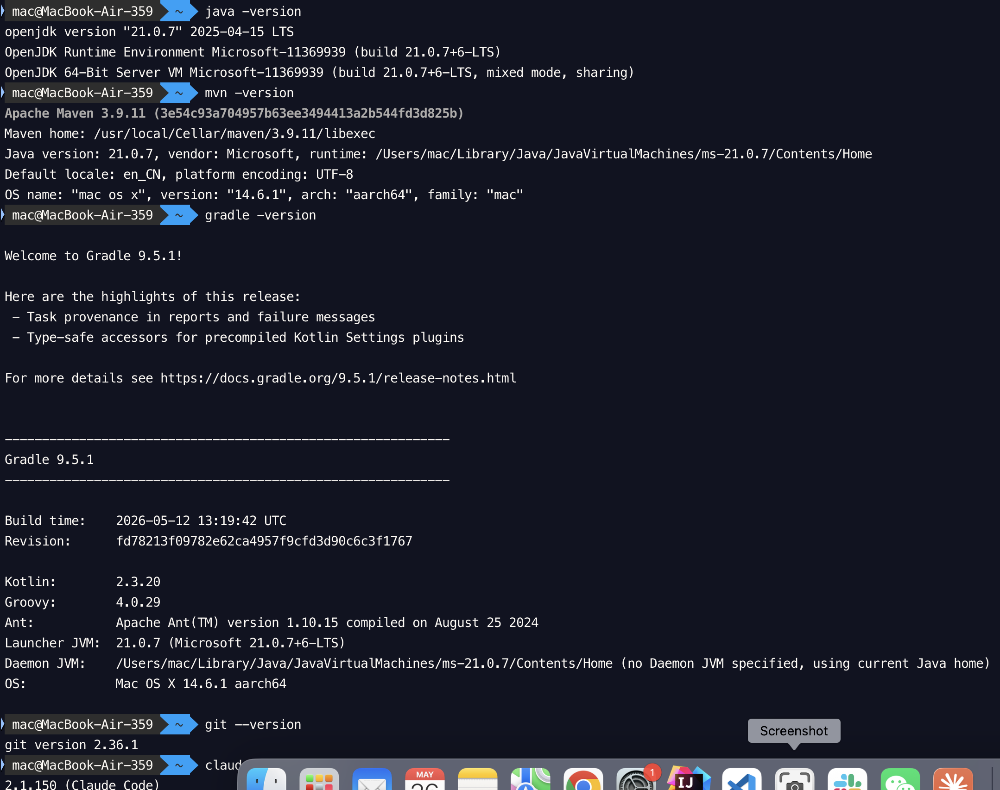
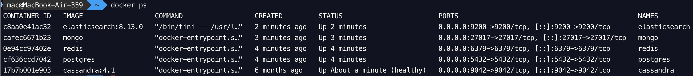
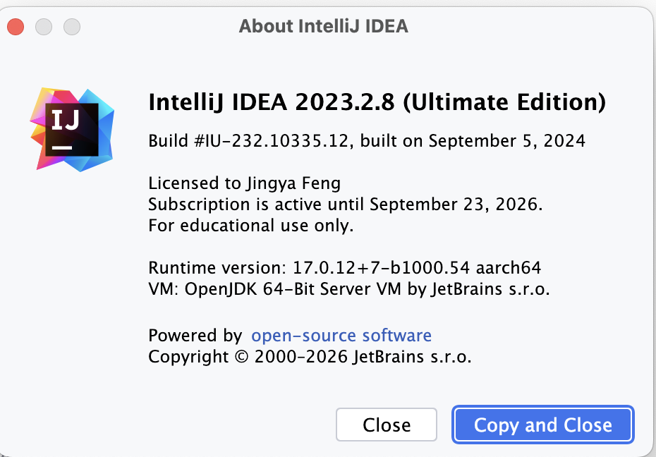
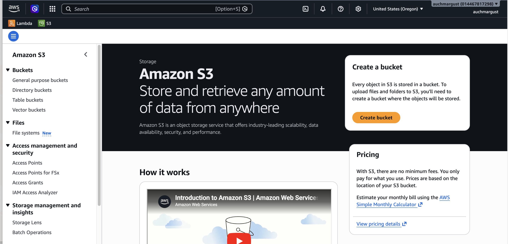
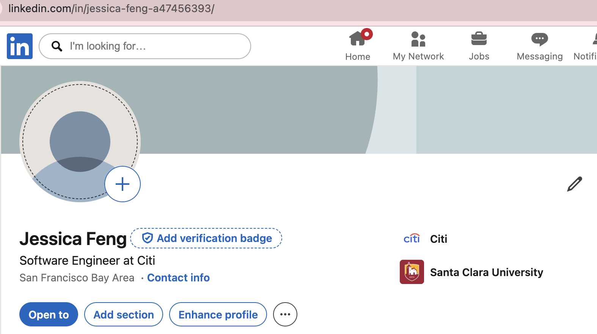
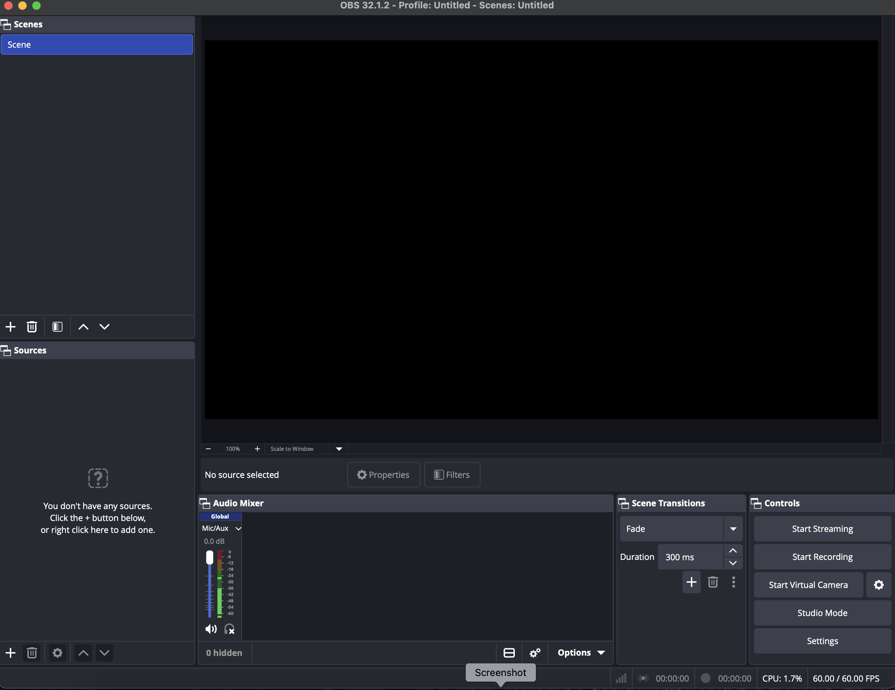
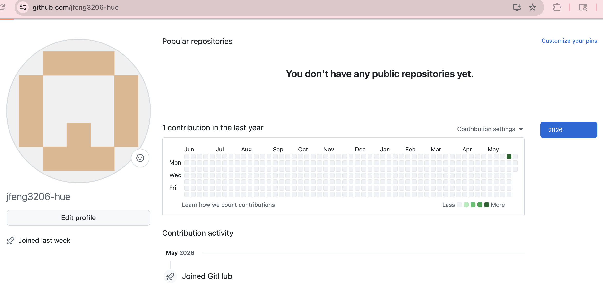

# Homework 1 — Environment Setup

## Java 17+, Maven, Gradle, Git, Claude

## Docker — Databases (Postgres, MongoDB, Redis, Cassandra, Elasticsearch)

## IntelliJ Ultimate License

## AWS S3 Bucket

## LinkedIn

## OBS

## Github
