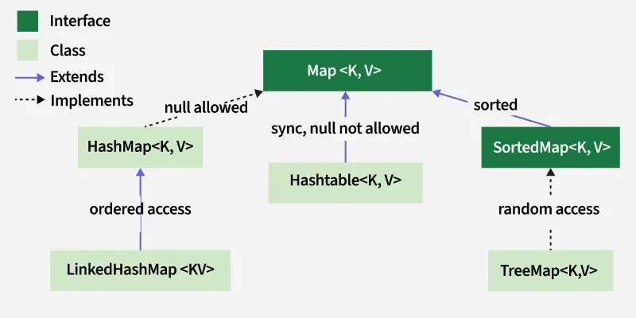
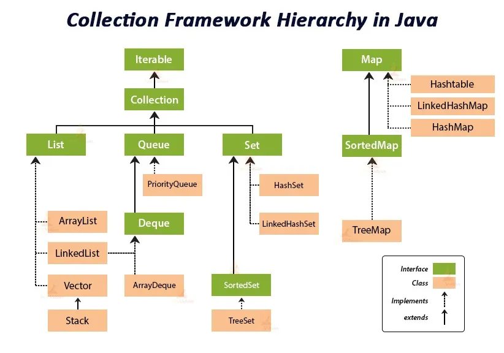

# Homework 1
- List vs Set

  List allows duplicae elements, maintains insertion order, and supports index-based access. (e.g. list.get(0)) The implementations for list include: *Arraylist* and *LinkedList*.

  Set contains only unique elements, does not guarantee order (except TreeSet), and has no indexing. Common implementations can include: *HashSet*, *LinkedHashSet*, *TreeSet*.

- LinkedList vs ArrayList

  LinkedList and ArrayList has different complexities for insertions and accesses.

  LinkedList: O(1) for insertion, O(n) for accessing

  ArrayList: O(n) for insertion, O(1) for accessing if position is known.

  Therefore, ArrayList is better for search-heavy work, and LinkedList is better for frequent additions or removals (writes).

- What is Map Interface

  

  Map Interface stroes data in key-value pairs. 

  HashMap is the most common and standard implementation, while LinkedHashMap is similar to LinkedList, maintaining the insertion order of keys. And TreeMap facilitates sorted order for keys. 

- How does HashMap work

  HashMap is the standarad implementation for Map interface. 
  
  It stores and retrieve data in key-value pairs in constat time O(1) on average.

  Each entry is stored as a Node object containing the key, value, hash and a reference to the next node in the bucket. 
  
  When duplicate keys appear, hash collisions occur. To resolve, the system generates a hash value, places it in a bucket, and uses the `equals` method to check for existing. If a collision occurs, a linked listt is attached to the position. If the linkedlist exceeds 8 elements, it is converted to a Red-Black tree to maintain an O(logn) time complexity. Therefore, it is mandatory to override both the `hashCode` and `equals` methods in any class template to ensure consistency and prevent errors. 

- What is hash collision

  Hash Collision occurs when different objects generate the same hash value.

- What is Collections used for

   

  Collection is used for store and iterate elements in a systematic ways efficiently.

  It contains important interfaces/types such as List, Set, and Queue.

- What is immutable class

  The instances are immutable because they cannot be modified after they are created. For example, a String class.

- HashTable vs HashMap vs ConcurrentHashmap

  Thread Safety: not for HashMap. But for HashTable and ConcurrentHashMap.

  Null key/value: 1 null key and multiple null values for HashMap. Not allowed for HashTable and ConcurrentHashMap.

  Note: HashTable is deprecated. The replacement for thread-safety implementation is ConcurrentHashMap.

- String vs StringBuilder vs StringBuffer

  Mutability: String is immutable, StringBuilder and StringBuffer are mutable.

  Thread-safety: not safe for StringBuilder, safe for StringBuffer.

- Why we need to override the hashcode and equals method at the same time

  It is related to HashMap's implementation.

  When stroing a object, the system generates a hash value, places it in a bucket, and uses the `equals` method to check for existing. Therefore, we need the correct hashCode and equals functions to make sure the object have the exact match.

  If we don't overwrite hashcode and equals method, we will not be able to distinguish between hash collision and key value pair update. 

- Play around the common data structure APIs (map, set, queue, list), write some practice codes

- Comparator vs Comparable, when to use which one

  Comparable defines the standard way a class should sort itself. E.g. `compareTo(obj)`
  ```package org.example;
  //comparable: default sort order.
  public class Movie implements Comparable<Movie>{
      private String movieName;
      private double rating;
      private int year;

      public Movie(String movieName, double rating, int year) {
          this.movieName = movieName;
          this.rating = rating;
          this.year = year;
      }

      @Override
      public String toString() {
          return "Movie{" +
                  "movieName='" + movieName + '\'' +
                  ", rating=" + rating +
                  ", year=" + year +
                  '}';
      }

      @Override
      public int compareTo(Movie o) {
          return this.year - o.year;
      }
  }
  ```

  Comparator defines customized or multiple sorting options. E.g. `compare(obj1, obj2)`.
  ```Collections.sort(list, new Comparator<Movie>(){
      @Override
      public int compare(Movie m1, Movie m2){
          return Double.compare(m1.getRating(),m2.getRating());
      }
    });
    list.stream().forEach(System.out::println);
  ```

- Overriding vs overloading

  Overriding: In-between classes. subclass provides specific implementation for a method definied in its parent class. Runtime polymorphism. Must have the same return type.

  Overloading: Within the same class. multiple methods share the same name but with different parameters. Compile time polymorphism. Can have the same or different return type. 


