# Java Study Notes

Handwritten notes, scanned from PDF and rendered as page images below.

### Page 01

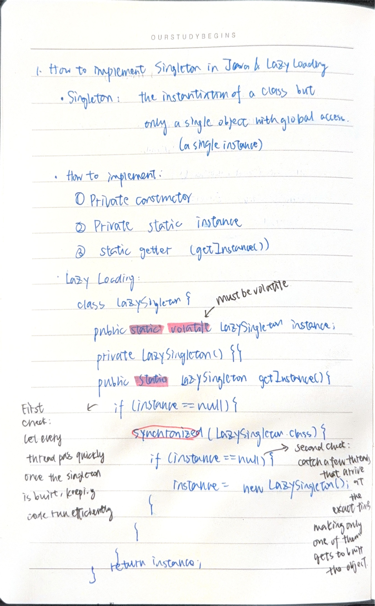

### Page 02

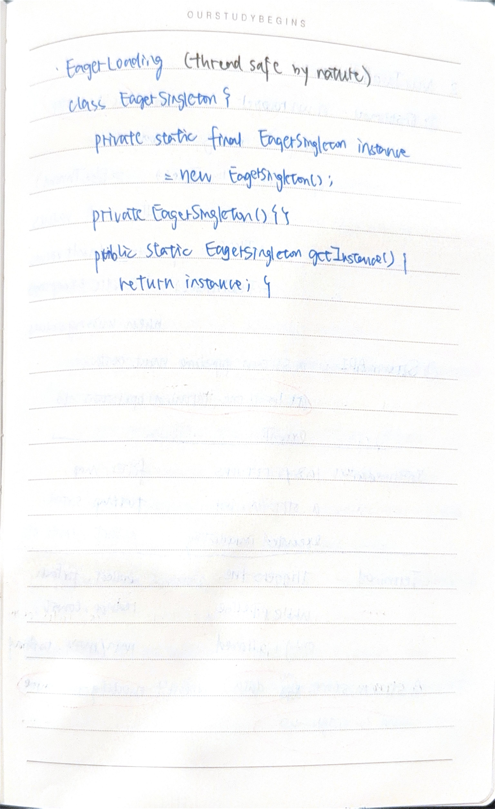

### Page 03

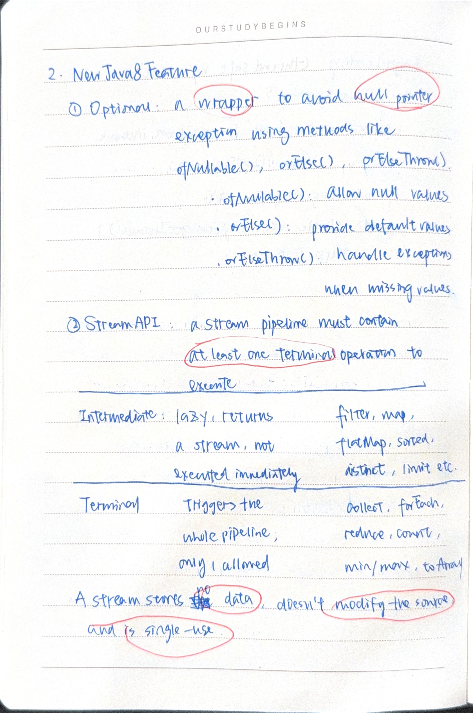

### Page 04

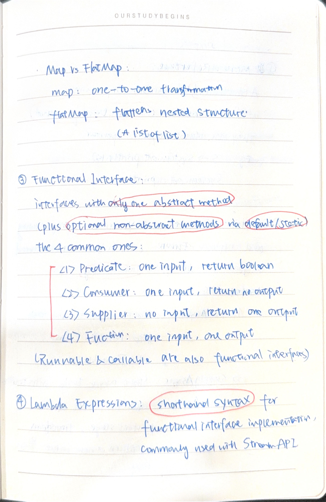

### Page 05

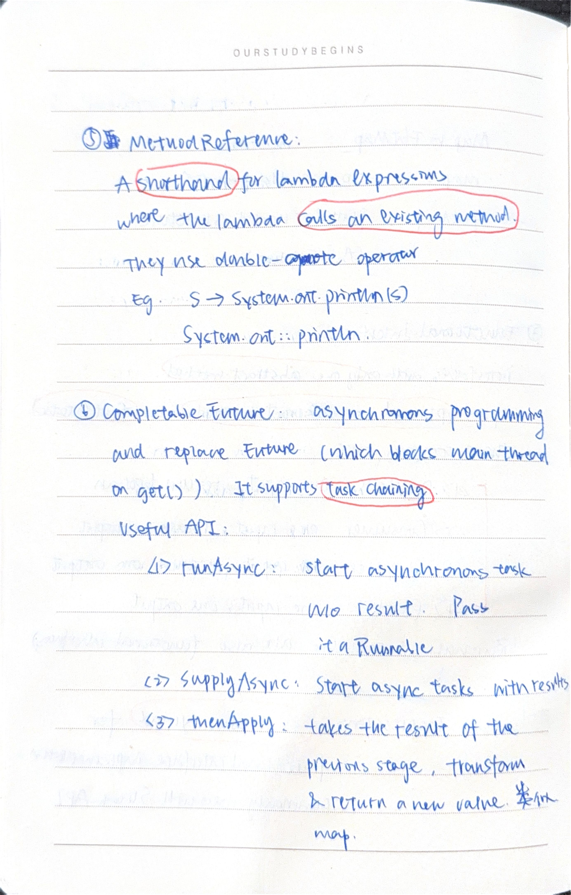

### Page 06

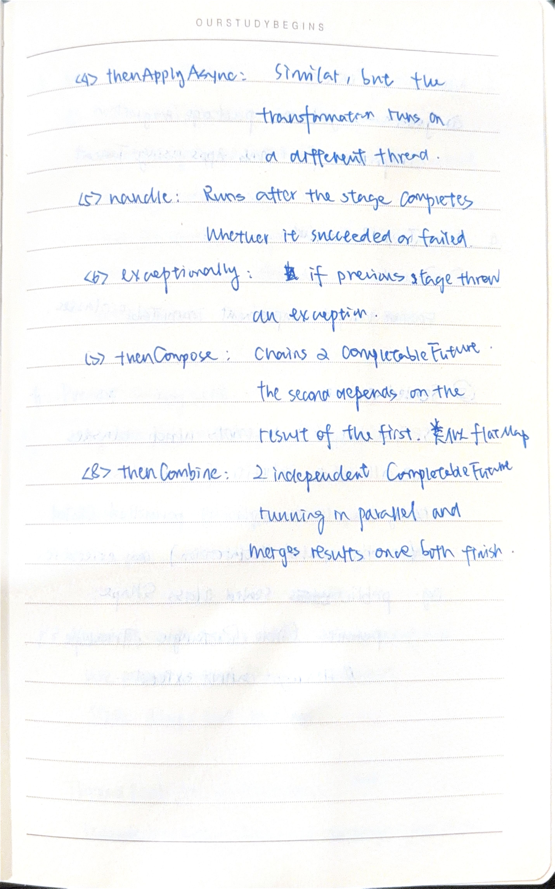

### Page 07

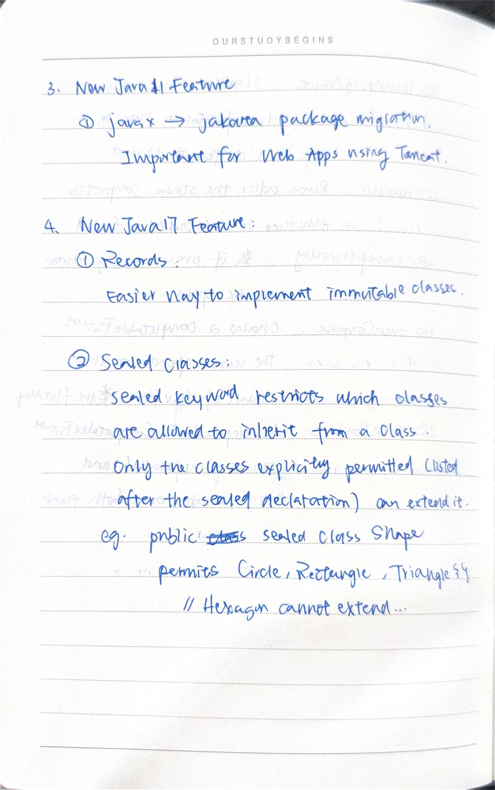

### Page 08

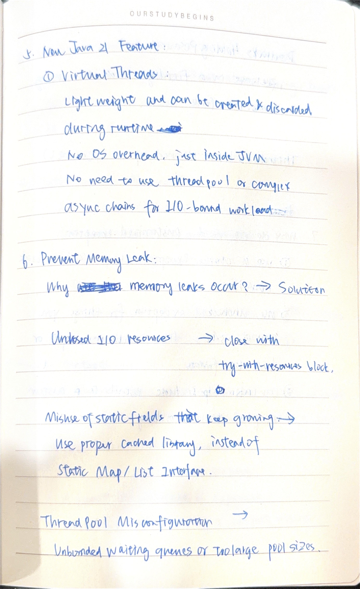

### Page 09

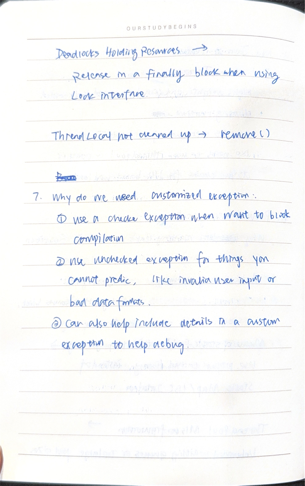

### Page 10

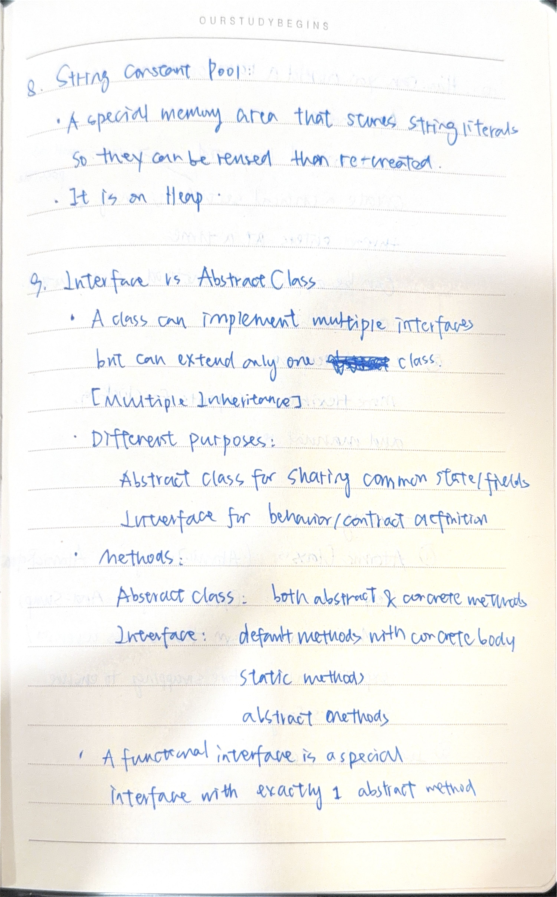

### Page 11

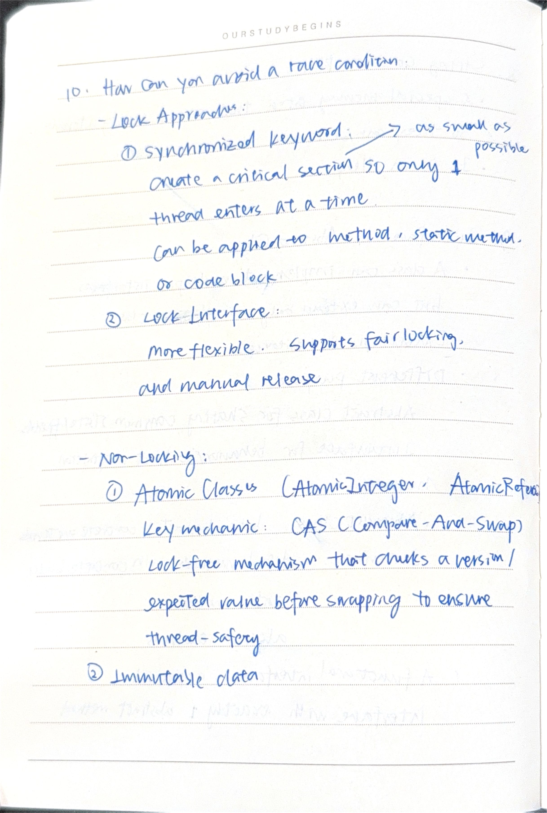

### Page 12

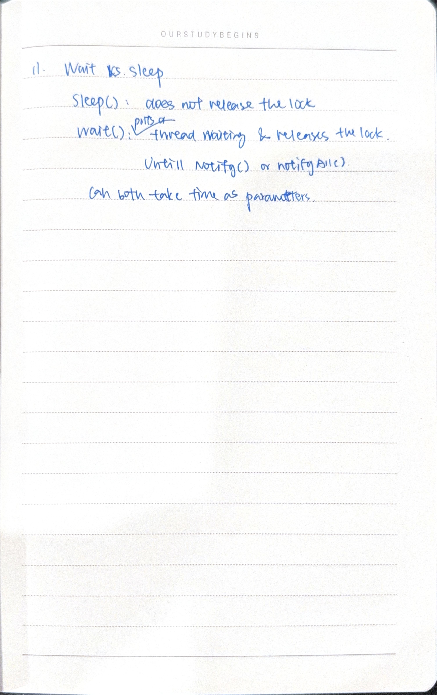

