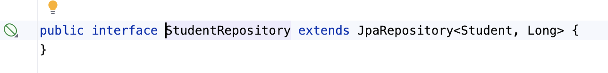
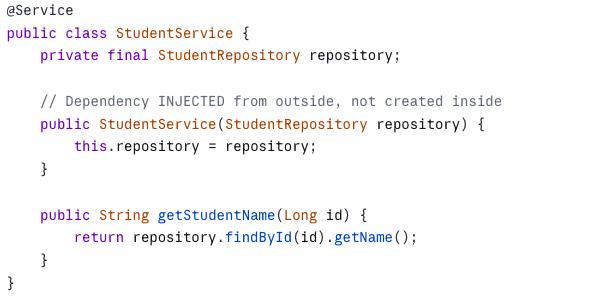

# Homework 9

- what is Spring IOC

  Spring Inversion of Control gives control of object creation and wiring to a container instead of the code creating its own dependencies. In Spring, the IoC container builds and manages the objects. 

- what is IOC Container

  IOC container is the core of Spring.

  The IoC container is represented by two interfaces — `BeanFactory` is the basic one, and `ApplicationContext` is the full-featured superset that's used in practically every real application. So when we say IoC container, we are always talking about the `ApplicationContext`
  
  It creates, configures, wires, and manages the lifecycle of the beans. We can use annotations like `@Component`/`Service` or config to tell the container what we need. The container will help build those objects, inject their dependencies, and manage them from creation to destruction.

- what is the advantage come with IOC

  - Loose coupling: classes depend on abstractions the container injects, so can freely swap implementations. 

  - Eaiser testing: can inject mock instead of real dependencies.

  - Less boilerplate configuration and centralized configuration

  - Automatic lifecycle management for better code maintainability

- what is Dependency Injection (DI)

  Dependency Injection is the implementation of IOC - it is how the container supplies (injects) a class's dependencies from outside, rather than the class constructing them.

- write a demo code to show what is Dependency Injection (give screenshot)

   
  

- what are different types of Dependency Injection

  3 Types:
  - Constructor Injection - dependencies are passed through the class constructor at object creation. Supports `final` or immutable. Best for mandatory.
    ```
      @Service
      public class StudentService {
          private final StudentRepository repository;
          public StudentService(StudentRepository repository) {  // injected via constructor
              this.repository = repository;
          }
      }
    ```
  - Setter Injection - injected after object construction. Better for optional. Does not support `final`
    ```
      @Service
      public class StudentService {
          private final StudentRepository repository;
          @Autowired
          public void setRepository(StudentRepository repository) { 
              this.repository = repository;
          }
      }
    ```
  - Field Injection
     ```
      @Service
      public class StudentService {
          @Autowired
          private final StudentRepository repository;
      }
    ```

- what are the pros and cons for each types of dependency Injection

  Constructior injection is recommended because it supports immutability, is guaranteed to be initialized and easier for testing. Setter injection is good for optional dependencies. Field injection is discouraged because it can't use final and hard to test without Spring.

- @Component vs @Bean

  - `@Component` is a class-level annotation. Put it on customized class and component scanning auto-detects and registers it. Stereotypes `@Service`, `@Controller`, `@Repository` are specializations of `@Component`.

  - `@Bean` is a method-level annotation used inside a `@Configuration` class. Use when we can't annotate the class (typicall 3rd party/library classes we don't own)
    ```
      @Configuration
      public class AppConfig {
          @Bean                           // third-party class you can't annotate
          public ObjectMapper objectMapper() {
              return new ObjectMapper().enable(SerializationFeature.INDENT_OUTPUT);
          }
      }
    ```

- what is @Configuration and @ComponentScan

  - @Configuration marks a class as a source of bean definitions. Contains @Bean methods. Spring proxies it so that calling one @Bean method from another returns the same singleton, not a new instance.

  - @ComponentScan tells Spring which packages to scan for @Component-annotated classes to auto-register.

  - @SpringBootApplication combines both, which is why Boot auto-discovers beans without user configuring it.

- @Controller vs @RestController

  @Controller is for MVC and returns view names for rendering pages. 
  
  @RestController is @Controller plus @ResponseBody, so every method's return value is serialized straight to JSON — that's what I use for REST APIs

- @Controller vs @Service vs @Repository

  They are all @Component specializations for the three layers.

  @Controller for the web layer, @Service for business logic, @Repository for data access.

  @Repository has additional value by translating database exception into Spring's unified DataAccessException hierarchy. 

- spring bean scope

  The scope defines a bean's lifecycle and how many instances the container creates.

  - Singleton: 1 shared instance per container.
  - Prototype: a new instance every time the bean is requestd
  - Request: 1 instance per HTTP request (web only)
  - Session: 1 instance per HTTP session (web only)
  - Application: 1 per ServletContext
  - WebSocket: 1 per WebSocket session. 

- singleton vs prototype

  - Singleton is one shared instance and the default and should be stateless

  - Prototype creates a new instance per request and can hold state. 
  
  - Spring doesn't destroy callbacks on prototypes. And injecting a prototype into a singleton only injects it once, so you don' actually get a fresh instance per call without a provider. 

- give me 3 uses cases for each of singleton, prototype, request and session bean scope

  - Singleton (stateless, shared)
    1. Service classes (@Service)
    2. Repository/DAO
    3. Shared infrastructure - config holders, cahces, connection pools
  
  - Prototype (fresh, often stateful instance each time)
    1. A stateful object that accumulates per-use data. E.g. shopping cart builder, query builder, order draft accumulating line items before submission
    2. A bean that's not thread-safe, where each user needs their own copy. E.g. a wrapper around a non-thread-safe library object (SimpleDateFormat)
    3. A command/task object configured differently per invocation. E.g. a task object you configure, then hand to an executor. Each task carries its own parameters and runtime state, so each needs to be a distinct instance. (like EmailJob, BatchImportJob, PaymentCommand holding one transaction' details)
  
  - Request:
    1. Per-request data holder like request-scoped context or a request Id.
    2. A per-requestion logging object capturing details of that one request
    3. Collection validation results for that request
  
  - Session:
    1. Shopping cart
    2. User preferences/settings for the logged-in session
    3. Multi-step flow state (e.g. a checkout or wizard spanning several requests in one session)

- session vs cookie

  Both maintain state across HTTP requests.

  Cookie preserves small data on the client (browser), sends back to the server with every request. Limited size (~4KB), visible or editable by the user, so not for sensitive data.

  Session preserves data on the server side. The client only holds a session ID (usually in a cookie) that the server uses to look up the session data. More secure because data never leaves the server and can have bigger data size.

